# Задание 1. Целевая архитектура и приоритизация проблем «Будущее 2.0»

## 1. Целевая архитектура через 1 год — ключевые принципы

1. **Облачная домено-ориентированная платформа.** Каждое бизнес-направление (Головной офис, Клиники, ИИ-сервисы, Финтех) — отдельный домен со своей средой в облаке. Домены независимы в развитии и релизах.
2. **Бизнес-логика вынесена из хранилища.** DWH больше не «монолит с логикой»: логика живёт в микросервисах доменов, платформа данных отвечает только за перемещение, хранение и витрины.
3. **Архитектура Lakehouse (Bronze → Silver → Gold).** Сырые сотни ТБ лежат в дешёвом объектном хранилище (озеро данных), аналитические витрины — в колоночном MPP-хранилище. Это даёт отчёты за минуты вместо часов.
4. **Событийная интеграция.** Легаси-ESB заменяется на шину событий (Kafka, CDC из БД) + API-шлюз для синхронных вызовов. Новый бизнес (фарма, медэлектроника) подключается по стандартному шаблону, без переделки ядра.
5. **Портал самообслуживания («витрина данных»).** Единая точка входа: готовые отчёты, конструктор отчётов, дашборды — с доступом по ролям (RBAC/ABAC). Единый семантический слой гарантирует одинаковые цифры во всех доменах.
6. **Безопасность и регуляторика by design.** Медицинские карты, истории болезней и результаты исследований **не попадают в аналитический контур**: их отделяет сервис анонимизации. Раздельные контуры для медицинской тайны (152-ФЗ) и банковской тайны (требования ЦБ РФ), маскирование, аудит, отказоустойчивость и геораспределение для критичных систем.

## 2. Отказ от легаси (обоснование)

| Легаси | Решение | Обоснование | Замена |
|---|---|---|---|
| DWH на MS SQL Server **2008** | **Вывод из эксплуатации** | EOL: нет патчей и поддержки, уязвимости ИБ; вертикальное масштабирование не тянет сотни ТБ; отчёты строятся часами | Облачный Lakehouse: озеро данных (объектное хранилище) + MPP-хранилище (Greenplum / ClickHouse / облачный DWH) |
| ESB на Apache Camel | **Вывод из эксплуатации** | Точечная интеграция, пакетный обмен, единая точка отказа, дорого подключать новые домены | Шина событий Apache Kafka (CDC/потоки) + API-шлюз с контрактами |
| Клиентский интерфейс на PowerBuilder | **Поэтапная замена** (допускается временное сохранение) | Умирающая технология, дефицит компетенций, дорого вносить изменения для врачей | Веб-МИС на современном стеке (микросервисы) |
| Кастомизации в BI поверх DWH | **Вывод кастомизаций** | Каждая доработка — проект в IT; дублирование метрик, «разные цифры» у подразделений | Семантический слой + конструктор отчётов в портале самообслуживания |

## 3. Диаграмма контейнеров (C4, уровень 2) — целевое состояние через 1 год

> Файлы: `c4_target_container.mmd` (Mermaid, отображается прямо на GitHub) и `c4_target_container.puml` (PlantUML).
> Ключевые бизнес-сценарии отмечены подписями на связях диаграммы.

```mermaid
C4Container
    title Целевая архитектура «Будущее 2.0» через 1 год — уровень контейнеров (C4)

    Person(po, "Менеджмент и аналитики головного офиса", "Управленческая и стратегическая отчётность")
    Person(pc, "Сотрудники клиник", "Врачи и операторы")
    Person(pa, "Специалисты ИИ-компании", "Обучение и эксплуатация ИИ-моделей")
    Person(pf, "Сотрудники финтех-компании (банк)", "Продуктовая и финансовая аналитика")

    Boundary(clinics, "Домен «Клиники»") {
        Container(mis, "МИС — веб-интерфейс клиник", "Веб-приложение, микросервисы", "Замена PowerBuilder: приём, назначения, расписание")
        ContainerDb(meddb, "Медицинская БД", "PostgreSQL, шифрование", "Медкарты, истории болезней, исследования — изолированы от аналитики")
        Container(anon, "Сервис анонимизации", "Микросервис", "Деперсонализация данных для аналитики и ИИ без врачебной тайны")
    }

    Boundary(fintech, "Домен «Финтех» (банк)") {
        Container(ftsvc, "Финтех-сервисы", "Golang / Java, микросервисы", "Кредиты, счета, платежи")
        ContainerDb(ftdb, "Банковская БД", "PostgreSQL", "Финансовая история, счета, кредиты")
    }

    Boundary(ai, "Домен «ИИ-сервисы»") {
        Container(aisvc, "ИИ-сервисы", "Python, ML-платформа", "Поддержка диагностики и лечения")
        ContainerDb(fstore, "Хранилище признаков", "Векторные/колоночные БД", "Анонимизированные данные и признаки")
    }

    Boundary(hq, "Домен «Головной офис»") {
        System_Ext(erp, "ERP / HR / Инвентаризация", "Учётные системы головного офиса")
    }

    Boundary(platform, "Единая облачная платформа данных") {
        Container(gw, "API-шлюз", "API Gateway", "Синхронная интеграция доменов по контрактам")
        ContainerQueue(bus, "Шина данных", "Apache Kafka", "События и CDC, замена легаси-ESB")
        ContainerDb(lake, "Озеро данных (Bronze)", "Объектное хранилище", "Сырые данные, сотни ТБ, дешёвое масштабирование")
        ContainerDb(dwh, "Хранилище-витрины (Silver/Gold)", "MPP: Greenplum / ClickHouse", "Доменные витрины, отчёты за минуты")
        Container(sem, "Семантический слой", "Магазин метрик, глоссарий", "Единые бизнес-показатели для всех доменов")
        Container(portal, "Портал самообслуживания («витрина данных»)", "Веб-приложение + BI-движок", "Готовые отчёты, конструктор отчётов, дашборды")
        Container(cat, "Каталог данных и качество", "Метедата-сервис", "Поиск датасетов, lineage, правила качества")
        Container(iam, "Сервис доступа и безопасности", "IAM, RBAC/ABAC", "Маскирование, аудит, 152-ФЗ и требования ЦБ")
    }

    Rel(pc, mis, "Работа с пациентами", "Сценарий: качество медсервисов")
    Rel(mis, meddb, "Чтение/запись", "Шифрование")
    Rel(mis, anon, "Передача данных")
    Rel(anon, bus, "Деперсонализированные события", "Сценарий: ИИ и аналитика без врачебной тайны")
    Rel(ftsvc, ftdb, "Чтение/запись")
    Rel(ftsvc, bus, "События и CDC", "Сценарий: near-real-time финтех-данные")
    Rel(erp, bus, "Загрузка данных")
    Rel(bus, lake, "Приём сырых данных", "Сценарий: масштабирование на сотни ТБ и новые бизнесы")
    Rel(lake, dwh, "Построение витрин", "Сценарий: быстрая подготовка отчётности")
    Rel(dwh, sem, "Публикация метрик")
    Rel(sem, portal, "Данные для отчётов")
    Rel(po, portal, "Отчёты и конструктор", "Сценарий: быстрые управленческие решения")
    Rel(pf, portal, "Финтех-аналитика", "Сценарий: независимое развитие финтеха")
    Rel(pa, cat, "Поиск датасетов", "Сценарий: независимое развитие ИИ")
    Rel(lake, aisvc, "Анонимизированные данные")
    Rel(aisvc, fstore, "Признаки для моделей")
    Rel(aisvc, gw, "ИИ-сервисы для МИС")
    Rel(iam, portal, "Авторизация, маскирование")
    Rel(gw, ftsvc, "Синхронные API по контрактам", "Сценарий: подключение новых бизнесов")
    Rel(gw, mis, "Синхронные API")
```

### Как архитектура поддерживает ключевые бизнес-сценарии

| Бизнес-сценарий | За счёт чего поддерживается |
|---|---|
| Быстрая подготовка отчётности (минуты вместо часов) | Озеро данных + колоночное MPP-хранилище с готовыми витринами (Gold), преагрегаты, семантический слой, портал с конструктором отчётов |
| Независимое развитие финтех- и ИИ-направлений | Изолированные домены в отдельных облачных средах, владение своими данными, взаимодействие только через контракты (API-шлюз, Kafka); бизнес-логика не живёт в DWH |
| Масштабирование под новые бизнесы (фарма, медэлектроника) | Стандартный онбординг: новый домен подключает системы к Kafka/API-шлюзу и получает свою среду и витрины, не трогая ядро платформы |
| Самообслуживание бизнес-пользователей | Портал «витрина данных» с RBAC/ABAC: отчёт в пределах уровня доступа + конструктор собственных отчётов без участия IT |
| Качество медицинских сервисов | Современная веб-МИС вместо PowerBuilder; ИИ-сервисы получают анонимизированные данные без врачебной тайны |
| Надёжность и регуляторика | Отказоустойчивость, бэкапы, геораспределение в облаке; раздельные контуры медтайны и банктайны, маскирование, аудит, соответствие 152-ФЗ и требованиям ЦБ РФ |

## 4. Проблемные места текущей архитектуры (AS-IS)

| ID | Проблема | Причина | Страдающие бизнес-сценарии | Влияние на бизнес |
|---|---|---|---|---|
| P-01 | Отчёты строятся часами | Один монолитный DWH, сотни ТБ, множество трансформаций на SQL Server 2008 | Управленческая отчётность, регуляторная отчётность, продуктовая аналитика | Задержки управленческих решений на дни; упущенная выручка; низкая скорость реакции на рынок |
| P-02 | Бизнес-логика финтеха и ИИ «зашита» в DWH | Историческое разрастание монолита | Независимое развитие доменов, интеграция новых бизнесов, релизы | Любой релиз — риск для всех; высокий time-to-market; невозможность развивать направления параллельно |
| P-03 | СУБД уровня EOL (SQL Server 2008) | Нет обновлений, патчей и поддержки вендора | Информационная безопасность, надёжность всех систем | Уязвимости, риск остановки бизнеса, дорого и рискованно обслуживать |
| P-04 | Нет самообслуживания в аналитике | Каждый отчёт делает IT-команда | Ежедневная аналитика в доменах, проверка гипотез | Недели ожидания отчёта; «теневой» IT (выгрузки в Excel); перегрузка IT |
| P-05 | Легаси-интеграция (ESB Apache Camel, точка-точка) | Пакетный обмен, отсутствие событийной модели | Данные почти в реальном времени для финтеха и ИИ, подключение новых компаний (фарма, электроника) | Данные приходят с задержкой; каждое новое подключение — отдельный проект |
| P-06 | Интерфейс клиник на PowerBuilder | Устаревшая технология, дефицит разработчиков | Операционная работа клиник, новые функции для врачей | Дорогие и долгие доработки; качество сервиса для врачей и пациентов |
| P-07 | Чувствительные данные (медкарты, истории болезней) смешаны с аналитикой в одном контуре | Единый DWH без разделения контуров | Аудиты регуляторов (152-ФЗ, врачебная тайна, банковская тайна) | Штрафы, риск отзыва лицензии банка, репутационные потери |
| P-08 | Нет единого семантического слоя и каталога данных | Кастомизации в BI, метрики считаются в разных местах по-разному | Кросс-доменная отчётность, управленческие решения | Несовпадение цифр у подразделений, недоверие к данным |
| P-09 | On-prem инфраструктура без геораспределения | Собственное железо | Доступность 24/7 клиник и банка, пиковые нагрузки | Простой = прямые убытки и деградация качества сервисов |
| P-10 | Хранилище не масштабируется под сотни ТБ и новые домены | Вертикальное масштабирование SQL Server | Рост ИИ (медизображения), интеграция фармы и медэлектроники | Невозможность развивать новые бизнес-направления |

## 5. Приоритизация проблем

### 5.1 Влияние проблем на бизнес-цели

| Проблема | Выручка | Time-to-market | Качество медсервисов | Качество финсервисов | Комплаенс и ИБ |
|---|---|---|---|---|---|
| P-01 Отчёты часами | Высокое | Высокое | Среднее | Высокое | Среднее |
| P-02 Логика в DWH | Среднее | Высокое | Среднее | Среднее | Низкое |
| P-03 EOL СУБД | Среднее | Низкое | Высокое | Высокое | Высокое |
| P-04 Нет самообслуживания | Среднее | Высокое | Низкое | Среднее | Низкое |
| P-05 Легаси-интеграция | Среднее | Высокое | Среднее | Высокое | Среднее |
| P-06 PowerBuilder | Низкое | Среднее | Высокое | Низкое | Низкое |
| P-07 Смешение данных | Среднее | Низкое | Высокое | Высокое | Высокое |
| P-08 Нет семантики | Среднее | Среднее | Низкое | Среднее | Низкое |
| P-09 On-prem, нет геораспределения | Высокое | Низкое | Высокое | Высокое | Среднее |
| P-10 Нет масштаба под новые бизнесы | Высокое | Высокое | Среднее | Низкое | Низкое |

### 5.2 Приоритизация MoSCoW

| Категория | Проблемы | Обоснование (связь с целями бизнеса) |
|---|---|---|
| **Must** (обязательно) | P-01, P-02, P-03, P-05, P-07 | P-03 и P-07 — регуляторные и ИБ-риски вплоть до остановки бизнеса (лицензия банка, 152-ФЗ). P-01 — скорость управленческих решений = выручка. P-02 и P-05 — фундамент: без развязки доменов и современной интеграции невозможны независимое развитие финтеха/ИИ и подключение новых бизнесов |
| **Should** (важно) | P-04, P-08, P-09, P-10 | P-04 и P-08 — целевой портал самообслуживания и доверие к данным (явное требование бизнеса). P-09 и P-10 — облако даёт отказоустойчивость и масштаб, но эффект раскрывается по мере миграции |
| **Could** (желательно) | P-06 | Модернизация интерфейса клиник: финальное состояние допускает временное сохранение легаси; миграцию можно завершить за горизонтом года |
| **Won't** (не в этом году) | Полная замена учётных систем головного офиса (ERP/HR) | Вне рамок данной трансформации — только интеграция через шину данных |

### 5.3 Матрица Эйзенхауэра

| | **Срочно** | **Не срочно** |
|---|---|---|
| **Важно** | **Сделать немедленно:** P-01 (отчёты часами), P-03 (EOL СУБД), P-07 (смешение мед/фин данных) — риски для выручки, ИБ и регуляторики уже сейчас | **Запланировать:** P-02 (логика в DWH), P-04 (самообслуживание), P-05 (интеграция), P-08 (семантика), P-09 (отказоустойчивость), P-10 (масштабируемость) — фундамент роста |
| **Не важно** | **Делегировать / временные меры:** P-06 (PowerBuilder) — поддерживающие патчи, параллельный проект миграции | **Не делать:** — таких проблем нет |

### 5.4 Последовательность работ и связь с состояниями бизнеса

| Горизонт | Что делаем | Проблемы | Состояние бизнеса |
|---|---|---|---|
| Месяцы 1–2 | Согласование архитектуры; облачный фундамент; разделение контуров мед/фин данных; границы доменов; планы витрин по доменам | P-03, P-07 | Промежуточное: архитектура согласована, домены определены, проекты запланированы |
| Месяцы 3–6 | Развязка доменов (логика из DWH), Kafka + API-шлюз, начало Lakehouse | P-02, P-05, P-10 | — |
| Месяцы 6–9 | Витрины данных, семантический слой, пилот портала | P-01, P-08 | — |
| Месяцы 9–12 | Портал в промышленной эксплуатации, отказоустойчивость/геораспределение, миграция с PowerBuilder (может частично сохраниться) | P-04, P-09, P-06 | Финальное: портал самообслуживания работает, бизнес-пользователи доменов работают в новой архитектуре |