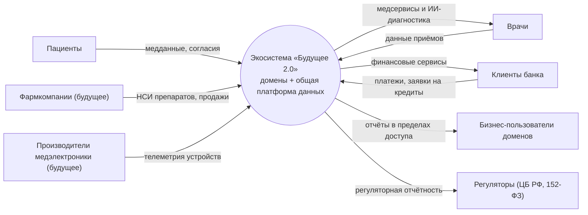
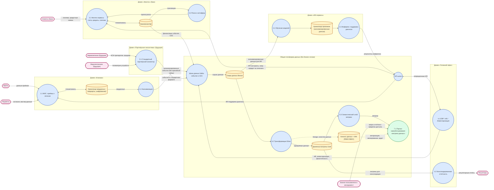

# Задание 2. Разделение системы на домены и моделирование потоков данных

## 1. Принципы разделения на домены

Разделение построено на трёх правилах:

1. **Границы доменов = границам бизнес-подразделений** (bounded contexts из DDD). Каждое направление — клиники, финтех, ИИ, головной офис — владеет своими данными и своей бизнес-логикой.
2. **Бизнес-логика не попадает в хранилище.** Домены развивают логику в своих сервисах; общая платформа данных содержит только курируемые данные (data products) и не содержит доменной логики. Это напрямую закрывает требование «интеграция новых направлений без внесения значительных объёмов бизнес-логики в DWH».
3. **Данные — продукт.** Домен публикует для остальных строго определённые продукты: потоки событий (Kafka) или API по контрактам (через API-шлюз). Прямой доступ к чужим транзакционным БД запрещён.

Дополнительно применяются принципы Data Mesh: доменное владение данными, самообслуживаемая платформа, федеративное управление (единые стандарты качества, безопасности и семантики при автономности доменов).

## 2. Каталог доменов

| Домен | Что входит | Данные во владении | Данные/сервисы, которые домен отдаёт другим | Почему граница именно такая |
|---|---|---|---|---|
| **1. Клиники** | МИС (замена PowerBuilder), медицинская БД, сервис анонимизации | Медкарты, истории болезней, результаты исследований (шифруются, **не покидают домен**) | Анонимизированные медицинские события; операционные API (записи, приёмы) | Граница по чувствительности: врачебная тайна остаётся внутри; наружу — только деперсонализированные данные. Поддерживает сценарий качества медсервисов |
| **2. ИИ-сервисы** | Обучение моделей, инференс, хранилище признаков (на Python) | Анонимизированные датасеты, признаки, версии моделей | API «поддержка диагноза»; метрики качества моделей | ИИ развивается независимо от клиник: свои вычислительные среды, свой жизненный цикл моделей. Поддерживает сценарий независимого развития ИИ |
| **3. Финтех (банк)** | Финтех-сервисы (Golang/Java), банковская БД, риски/антифрод | Финансовая история, счета, кредиты, платежи | Финансовые события (CDC); платёжные и кредитные API по контрактам | Банковская лицензия и регуляторика ЦБ требуют изоляции. Поддерживает сценарий независимого развития финтеха и быстрого вывода финпродуктов |
| **4. Головной офис** | ERP/HR/инвентаризация, консолидированная и регуляторная отчётность | Персонал, инвентаризация, финансовая отчётность, НСИ | Мастер-данные; регуляторная отчётность | Корпоративные функции отделены от операционных доменов; получают готовые витрины, а не «лезут» в чужие системы |
| **5. Партнёрская экосистема (будущее)** | Стандартный партнёрский коннектор, «песочница» для новых направлений | Данные фармы (НСИ препаратов, продажи) и телеметрия медэлектроники — после подключения | Партнёрские события в стандартном формате | Новое направление подключается по шаблону за недели, без перестройки ядра. Поддерживает сценарий масштабирования на фарму и электронику |
| **6. Общая платформа данных (горизонтальный слой)** | Шина данных (Kafka), API-шлюз, озеро данных, витрины, семантический слой, портал самообслуживания, каталог, IAM | Сырые и курируемые данные (без бизнес-логики), метрики, права доступа | Витрины и метрики всем доменам; портал самообслуживания | Единая самообслуживаемая инфраструктура: домены не строят свои хранилища с нуля, но и не зависят от единого монолита |

### Правила взаимодействия между доменами

- **Асинхронно** — только события через шину данных (публикация/подписка, идемпотентность, схема-контракт).
- **Синхронно** — только через API-шлюз по зарегистрированным контрактам (версионирование, лимиты, авторизация).
- **Запрещено** прямое чтение чужих транзакционных БД и общая бизнес-логика в хранилище.
- Каждый поток описан в каталоге данных с владельцем, SLA и классом чувствительности.
- Чувствительные данные: медтайна не выходит за домен «Клиники» (наружу — только после анонимизации), финданные — по требованиям ЦБ РФ, с маскированием в витринах по ролям.

## 3. DFD

### 3.1 Контекстная диаграмма (уровень 0)

### 3.2 Детальная DFD (уровень 1)

> Ключевые бизнес-сценарии отмечены подписями на потоках и в легенде ниже.

## 4. Как бизнес-сценарии обеспечены потоками данных

| Бизнес-сценарий | Потоки на DFD | Что это даёт |
|---|---|---|
| Врач ставит диагноз с помощью ИИ | 1.1 → медхранилище → 1.2 (анонимизация) → шина → озеро → 2.1 (обучение) → 2.2 → API-шлюз → 1.1 | ИИ получает данные без врачебной тайны; клиники получают результат по API; домены не зависят от внутреннего устройства друг друга |
| Интеграция нового финтех-сервиса | 3.1 публикует события в шину + регистрирует контракт в API-шлюзе → витрина → семантика → портал | Новый сервис не требует доработки DWH: достаточно опубликовать события и API-контракт |
| Онбординг нового партнёра (фарма, электроника) | Фарма/электроника → 5.1 (стандартный коннектор) → шина → отдельная партнёрская витрина | Подключение по шаблону за недели; изолированная «песочница» не влияет на ядро |
| Быстрая управленческая отчётность | шина → озеро → трансформации → витрины → семантический слой → 7.1 портал | Отчёты за минуты; каждый пользователь видит данные только в пределах своего уровня доступа |
| Регуляторная отчётность | витрины → 4.2 консолидация → регуляторы | Единая версия правды и прослеживаемость (lineage) для аудитов |
| Целостность показателей по всей компании | все витрины → 6.3 семантический слой → портал | Одинаковые метрики во всех доменах, несмотря на их независимое развитие |

## 5. Аргументация: преимущества для бизнеса

| Преимущество | Как достигается | Эффект для бизнеса |
|---|---|---|
| **Ускорение вывода продуктов (TTM)** | Параллельная разработка в изолированных доменах; стандартный шаблон онбординга новых направлений; релизы без кросс-регрессии всего ландшафта | Новые финтех-продукты и ИИ-сервисы выходят за недели, а не месяцы; фарму и электронику можно подключать без «большого взрыва» интеграции |
| **Снятие зависимости от DWH** | Бизнес-логика живёт в сервисах доменов; платформа хранит только курируемые данные и метрики | Хранилище больше не узкое место: изменения в логике финтеха/ИИ не требуют пересборки отчётности и не ломают другие домены |
| **Независимое развитие направлений** | Отдельные облачные среды, свои технологические стеки (клиники — веб, ИИ — Python, финтех — Golang/Java), контракты вместо общей кодовой базы | Каждое направление масштабируется и выбирает технологии под свои задачи; команды автономны, но показатели компании остаются целостными |
| **Надёжность и локализация сбоев** | Изоляция доменов, отсутствие общих точек отказа (вместо монолитного DWH и старой ESB) | Сбой в одном направлении не останавливает клиники или банк |
| **Комплаенс и ИБ** | Медкарты не покидают домен «Клиники» (анонимизация на границе); банковские данные изолированы по требованиям ЦБ; маскирование и аудит в портале | Снижение регуляторных рисков (152-ФЗ, банковская тайна) — обязательное условие для покупки банка и планов на фарму |
| **Самообслуживание при целостности данных** | Доменные витрины + единый семантический слой + портал с RBAC/ABAC | Бизнес сам строит отчёты по любым срезам, но по единым метрикам — «одна версия правды» для всех направлений |