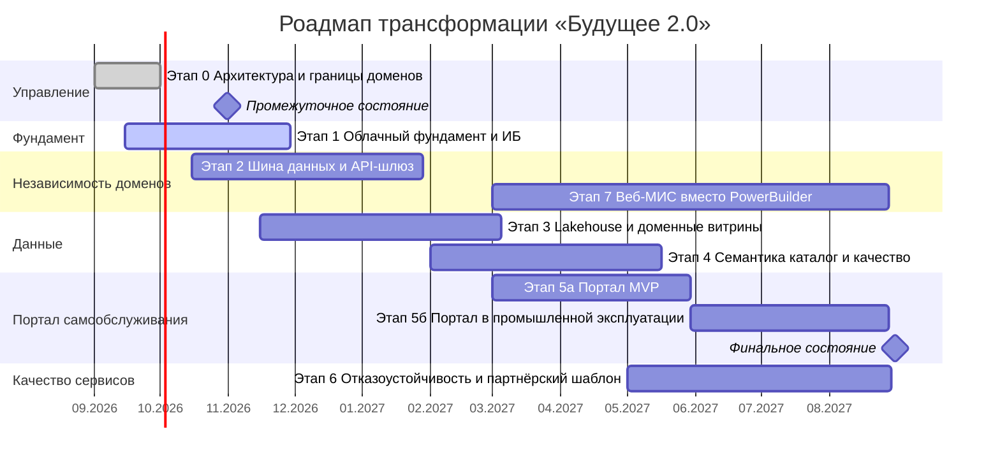

# Роадмап трансформации технологического ландшафта «Будущее 2.0»

Горизонт: сентябрь 2026 — август 2027 (12 месяцев). Этапы привязаны к бизнес-целям: запуск портала самообслуживания, независимое развитие подразделений, качество медицинских и финансовых сервисов.

## Обзор (диаграмма Ганта)

## Этап 0. Согласование архитектуры и границ доменов (сентябрь 2026)

- **Бизнес-цель:** единый вектор трансформации; промежуточное состояние «архитектура согласована, домены определены».
- **Шаги:** утвердить целевую архитектуру (Задание 1) и разделение на домены с потоками данных (Задание 2); зафиксировать ADR; утвердить планы проектов витрин в каждом домене.
- **Ожидаемые результаты:** подписанное архитектурное решение, реестр доменов и контрактов взаимодействия, планы проектов по развитию «витрины данных».
- **Ответственные команды:** Архитектурный комитет (CTO-офис), лиды доменов «Клиники», «Финтех», «ИИ», «Головной офис».
- **Ресурсы:** 4–6 архитекторов, 2 недели кросс-доменных воркшопов.

## Этап 1. Облачный фундамент и информационная безопасность (сентябрь — ноябрь 2026)

- **Бизнес-цель:** критически важные меры для качества медицинских и финансовых сервисов — комплаенс и безопасность до начала миграции данных.
- **Шаги:** облачная landing zone с изолированными средами на домен (IaC); сетевая сегментация контуров медтайны и банктайны; IAM/SSO и RBAC/ABAC; шифрование и управление ключами; политика резервного копирования и план аварийного восстановления.
- **Ожидаемые результаты:** готовые облачные среды для всех доменов; медицинская тайна и банковская тайна изолированы; доступы аудируемы; пройден внутренний аудит ИБ.
- **Ответственные команды:** Инфраструктура и DevSecOps, команда ИБ.
- **Ресурсы:** 5–7 инженеров, подписка облака, решение IAM.

## Этап 2. Интеграционный хребет и развязка доменов (октябрь 2026 — январь 2027)

- **Бизнес-цель:** независимое развитие подразделений; интеграция новых направлений без бизнес-логики в DWH.
- **Шаги:** развёртывание Kafka со Schema Registry и API-шлюза; настройка CDC из доменных БД; вынос бизнес-логики финтеха и ИИ из DWH в сервисы доменов; регистрация контрактов и дата-продуктов в каталоге; вывод легаси-ESB из эксплуатации.
- **Ожидаемые результаты:** домены обмениваются только событиями и API по контрактам; новая логика больше не попадает в хранилище; прямые доступы к чужим БД устранены.
- **Ответственные команды:** Платформенная команда + команды доменов «Финтех», «ИИ», «Клиники».
- **Ресурсы:** 8–10 инженеров, кластер Kafka, API-шлюз.

## Этап 3. Lakehouse и доменные витрины (ноябрь 2026 — март 2027)

- **Бизнес-цель:** быстрая подготовка отчётности (минуты вместо часов), масштабируемость на сотни ТБ.
- **Шаги:** озеро данных (Bronze) в объектном хранилище; витринные трансформации (Silver → Gold) по четырём доменам; миграция исторических данных из SQL Server 2008 без медицинских карт и историй болезней; вывод СУБД уровня EOL из эксплуатации.
- **Ожидаемые результаты:** отчёты строятся за минуты; доменные витрины готовы для портала; устранены риски EOL и лицензионные затраты на старую СУБД.
- **Ответственные команды:** Платформенная команда (data engineering).
- **Ресурсы:** 6–8 дата-инженеров, MPP-кластер, объектное хранилище.

## Этап 4. Семантический слой, каталог и качество данных (февраль — май 2027)

- **Бизнес-цель:** целостность ключевых бизнес-показателей, скорость и достоверность управленческих решений.
- **Шаги:** магазин метрик и бизнес-глоссарий; каталог данных с lineage по всем витринам; автоматические правила качества (DQ) для критичных потоков; назначение дата-стюардов в доменах.
- **Ожидаемые результаты:** единые метрики во всех подразделениях; происхождение данных прослеживается; качество контролируемо.
- **Ответственные команды:** Платформенная команда + офис управления данными (дата-стюарды доменов).
- **Ресурсы:** 4–6 инженеров, 2 дата-стюарда, каталог данных.

## Этап 5. Портал самообслуживания «витрина данных» (март — август 2027)

- **Бизнес-цель:** самообслуживание бизнес-пользователей — ключевой результат финального состояния.
- **Шаги (5а, MVP):** готовые отчёты по витринам головного офиса и финтеха; доступы по ролям (без медкарт и историй болезней в контуре); пилот на 2–3 бизнес-командах.
- **Шаги (5б, промышленная эксплуатация):** конструктор собственных отчётов; подключение витрин клиник и ИИ; нагрузочное тестирование; обучение пользователей и поддержка.
- **Ожидаемые результаты:** бизнес-пользователи всех доменов получают отчёты по любым срезам в пределах уровня доступа и строят собственные отчёты без участия IT.
- **Ответственные команды:** Команда портала/BI, Платформенная команда, дата-стюарды доменов.
- **Ресурсы:** 5–7 разработчиков, 1 UX-специалист, BI-движок.

## Этап 6. Отказоустойчивость и партнёрский шаблон (май — август 2027)

- **Бизнес-цель:** качество медицинских и финансовых сервисов 24/7; масштабируемость на фарму и электронику.
- **Шаги:** геораспределённое развёртывание критичных систем; учения по аварийному восстановлению; мониторинг и алерты; FinOps-контроль затрат; стандартный партнёрский коннектор и «песочница» для новых направлений.
- **Ожидаемые результаты:** доступность сервисов соответствует SLA; подключение нового партнёра выполняется по шаблону за недели; облачные расходы под контролем.
- **Ответственные команды:** Инфраструктура, Платформенная команда, SRE доменов «Клиники» и «Финтех».
- **Ресурсы:** 4–6 инженеров, второй гео-регион облака.

## Этап 7. Модернизация интерфейса клиник (март — август 2027 и далее)

- **Бизнес-цель:** качество медицинских сервисов — современный инструмент врача.
- **Шаги:** пилот веб-МИС в 1–2 клиниках; поэтапный перевод клиник с PowerBuilder (допускается временное сохранение легаси в отдельных клиниках на горизонте года); интеграция веб-МИС с ИИ-поддержкой диагноза через API-шлюз.
- **Ожидаемые результаты:** первые клиники работают в новом интерфейсе; план полного отказа от PowerBuilder утверждён.
- **Ответственные команды:** Команда домена «Клиники».
- **Ресурсы:** 4–6 разработчиков, 1 UX-специалист.