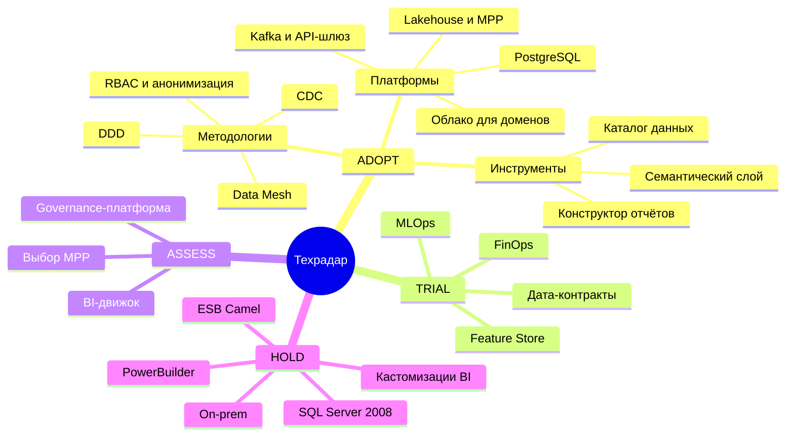

# Технический радар «Будущее 2.0»

Кольца: **ADOPT** — внедряем сейчас; **TRIAL** — пилотируем на ограниченных сценариях; **ASSESS** — оцениваем и выбираем решение; **HOLD** — прекращаем развитие и выводим из эксплуатации.

## Обзор

## ADOPT — внедряем

| Категория | Технология | Текущая / Предлагаемая | Поддерживаемые бизнес-сценарии | Бизнес-эффект |
|---|---|---|---|---|
| Платформы | Облачная платформа с отдельными средами на домен | Предлагаемая (замена on-prem) | Масштабирование отчётности; независимое развитие подразделений; отказоустойчивость клиник и банка | Гибкие ресурсы под нагрузку, быстрый TTM, уход от затрат на устаревшее железо |
| Платформы | Объектное хранилище (S3-совместимое), озеро данных Bronze | Предлагаемая | Сотни ТБ данных; данные для ИИ; подключение новых бизнесов | Дешёвое горизонтальное масштабирование хранения |
| Платформы | Колоночное MPP-хранилище (Greenplum / ClickHouse) | Предлагаемая (замена SQL Server 2008) | Быстрая подготовка отчётности — минуты вместо часов | Скорость управленческих решений |
| Платформы | Apache Kafka + Schema Registry | Предлагаемая (замена легаси-ESB) | Интеграция новых бизнесов; near-real-time данные для финтеха и ИИ | Стандартный онбординг доменов, события вместо пакетных выгрузок |
| Платформы | API-шлюз с реестром контрактов | Предлагаемая | Синхронная интеграция клиник, финтеха, ИИ; онбординг партнёров | Независимые релизы, контролируемая безопасность |
| Платформы | PostgreSQL для доменных БД (с шифрованием) | Предлагаемая | Качество медсервисов (медкарты), качество финсервисов (счета, кредиты) | Надёжность и комплаенс (152-ФЗ, банковская тайна) |
| Методологии | Data Mesh (доменное владение данными, данные как продукт) | Предлагаемая | Интеграция новых бизнесов без бизнес-логики в DWH; автономность доменов | Масштабируемость экосистемы, снижение связности |
| Методологии | DDD — границы доменов по подразделениям | Предлагаемая | Независимое развитие клиник, финтеха, ИИ, головного офиса | Релизы без кросс-регрессии всего ландшафта |
| Методологии | Архитектура Lakehouse (Bronze/Silver/Gold) | Предлагаемая | Быстрая отчётность + данные для ИИ из единого контура | Меньше дублирующих трансформаций, единая трасса данных |
| Методологии | CDC (захват изменений из БД) | Предлагаемая | Операционные данные финтеха и ИИ в реальном времени | Свежесть данных без пакетных окон |
| Методологии | Управление доступом RBAC/ABAC, маскирование, аудит | Предлагаемая | Портал самообслуживания; комплаенс мед- и финданных | Допуск регуляторов, снижение штрафов и репутационных рисков |
| Методологии | Анонимизация медицинских данных на границе домена | Предлагаемая | Использование ИИ для анализа медицинских данных без врачебной тайны | Качество диагностики без регуляторных рисков |
| Методологии | IaC + CI/CD | Предлагаемая | Быстрый развёртывание сред доменов и партнёров | Скорость вывода продуктов, повторяемость |
| Инструменты | Каталог данных с lineage | Предлагаемая | Самообслуживание, доверие к данным, аудиты | Скорость поиска данных и принятия решений |
| Инструменты | Семантический слой / магазин метрик | Предлагаемая | Целостность ключевых бизнес-показателей по всем направлениям | Одна версия правды для менеджмента |
| Инструменты | BI-движок с конструктором отчётов | Предлагаемая | Портал самообслуживания: готовые и собственные отчёты | Снятие «узкого места» IT-команды |
| Инструменты | Observability (мониторинг, алерты, трассировка) | Предлагаемая | Поддержание качества медицинских и финансовых сервисов 24/7 | Доступность критичных систем |
| Языки и фреймворки | Python (ИИ-сервисы) | Текущая — сохранить | ИИ-диагностика и поддержка лечения | Сохранение компетенций команды |
| Языки и фреймворки | Golang / Java (финтех-сервисы) | Текущая — сохранить | Финансовые сервисы банка | Сохранение компетенций команды |
| Языки и фреймворки | Современный веб-стек для МИС | Предлагаемая (замена PowerBuilder) | Качество медицинских сервисов, работа врачей | Дешёвая и быстрая доработка интерфейсов клиник |

## TRIAL — пилотируем

| Категория | Технология | Поддерживаемые бизнес-сценарии | Бизнес-эффект |
|---|---|---|---|
| Платформы | Feature Store / векторная БД для ИИ | ИИ-анализ медицинских данных, масштабирование моделей | Ускорение вывода ИИ-моделей в эксплуатацию |
| Методологии | Дата-контракты с SLA между доменами | Интеграция финтеха, ИИ и будущих партнёров | Меньше интеграционных инцидентов |
| Методологии | FinOps (управление облачными затратами) | Все сценарии в облаке | Контроль и снижение затрат |
| Инструменты | Встраиваемая аналитика (конструктор отчётов в портале) | Самообслуживание бизнес-пользователей | Проверка гипотез за часы, а не недели |
| Инструменты | MLOps-платформа (реестр моделей, пайплайны) | Независимое развитие ИИ-направления | Стабильный и воспроизводимый выпуск моделей |

## ASSESS — оцениваем (решение по итогам PoC)

| Категория | Технология | Поддерживаемые бизнес-сценарии | Критерий выбора |
|---|---|---|---|
| Платформы | Конкретное MPP: Greenplum vs ClickHouse vs managed-DWH облака | Быстрая отчётность | Цена/производительность на сотнях ТБ |
| Инструменты | BI-движок портала: open-source vs встроенный vs Power BI поверх семантического слоя | Самообслуживание | Стоимость лицензий, требования к конструктору |
| Инструменты | Governance-платформа (каталог, качество, политики) | Доверие к данным, комплаенс | Интеграция с каталогом и IAM |
| Платформы | Service Mesh для межсервисного mTLS | Безопасность интеграций доменов | Накладные расходы на эксплуатацию |
| Платформы | GPU-кластер для обучения ИИ (облачный vs выделенный) | ИИ-анализ медицинских данных | Стоимость обучения моделей |

## HOLD — прекращаем развитие и выводим

| Категория | Технология | Почему останавливаем | Замена | Затрагиваемые бизнес-сценарии |
|---|---|---|---|---|
| Платформы | DWH на MS SQL Server 2008 | EOL: нет патчей и поддержки; не масштабируется на сотни ТБ | Озеро данных + MPP-хранилище | Все сценарии: ИБ, отчётность, масштабирование |
| Платформы | ESB на Apache Camel | Точечная пакетная интеграция, узкое место для новых доменов | Kafka + API-шлюз | Интеграция новых бизнесов, real-time данные |
| Инструменты | Клиентский интерфейс на PowerBuilder | Дефицит компетенций, дорогие изменения | Веб-МИС | Качество медицинских сервисов |
| Инструменты | Кастомизации в Power BI поверх DWH | Дублирование метрик, каждая доработка — проект | Семантический слой + конструктор отчётов | Быстрая отчётность, целостность показателей |
| Платформы | Размещение критичных систем только on-prem | Ограниченная доступность и масштаб, дорогое железо | Облако с отказоустойчивостью и геораспределением | Доступность клиник и банка 24/7 |